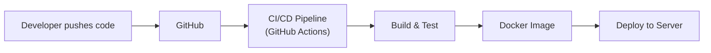

# Wellfitness — Real-World Deployment Guide

## How Real Companies Deploy (and how you should too)



---

## 1. Two Environments: Dev vs Production

| | **Dev (Local)** | **Production** |
|---|---|---|
| **Purpose** | Build & test | Real users |
| **DB** | `localhost:3306` | Cloud MySQL (RDS/Railway) |
| **Frontend** | `localhost:5173` (Vite dev) | Built static files on Vercel/Netlify |
| **Backend** | `localhost:8080` | Docker container on Railway/Render/EC2 |
| **Secrets** | Hardcoded in `application.properties` | **Environment variables** (never in code) |
| **URL** | `http://localhost` | `https://api.wellfitness.in` |

### How to handle config per environment

```
# application.properties (keep defaults for dev)
server.port=8080
spring.datasource.url=${DB_URL:jdbc:mysql://localhost:3306/wellfitness_db}
spring.datasource.username=${DB_USER:root}
spring.datasource.password=${DB_PASS:159Atg45@}
app.jwt.secret=${JWT_SECRET:dev_secret_key_change_in_prod}
```

In production, set `DB_URL`, `DB_USER`, `DB_PASS`, `JWT_SECRET` as environment variables — the app reads those instead.

---

## 2. Dockerize (Package Your App)

### Backend — `Dockerfile`
```dockerfile
# Step 1: Build
FROM gradle:8-jdk17 AS build
WORKDIR /app
COPY . .
RUN gradle bootJar --no-daemon

# Step 2: Run (smaller image)
FROM eclipse-temurin:17-jre-alpine
WORKDIR /app
COPY --from=build /app/build/libs/*.jar app.jar
EXPOSE 8080
ENTRYPOINT ["java", "-jar", "app.jar"]
```

### Frontend — Just build & deploy static
```bash
npm run build   # creates dist/ folder
# Upload dist/ to Vercel/Netlify — no Docker needed
```

### `docker-compose.yml` (for running locally with MySQL)
```yaml
version: '3.8'
services:
  db:
    image: mysql:8
    environment:
      MYSQL_ROOT_PASSWORD: 159Atg45@
      MYSQL_DATABASE: wellfitness_db
    ports:
      - "3306:3306"

  backend:
    build: ./backend
    ports:
      - "8080:8080"
    environment:
      DB_URL: jdbc:mysql://db:3306/wellfitness_db
      DB_USER: root
      DB_PASS: 159Atg45@
      JWT_SECRET: your_production_secret_here
    depends_on:
      - db
```

**Run:** `docker-compose up` → both MySQL + backend start together.

---

## 3. CI/CD Pipeline (Auto-deploy on push)

Create `.github/workflows/deploy.yml`:

```yaml
name: Deploy Wellfitness
on:
  push:
    branches: [main]

jobs:
  deploy-backend:
    runs-on: ubuntu-latest
    steps:
      - uses: actions/checkout@v4

      - name: Set up JDK 17
        uses: actions/setup-java@v4
        with:
          java-version: '17'
          distribution: 'temurin'

      - name: Build & Test
        run: cd backend && ./gradlew build

      - name: Build Docker Image
        run: docker build -t wellfitness-api ./backend

      - name: Push to Registry & Deploy
        # Use Railway/Render CLI or push to Docker Hub
        run: echo "Deploy to your hosting provider here"

  deploy-frontend:
    runs-on: ubuntu-latest
    steps:
      - uses: actions/checkout@v4
      - run: cd frontend && npm ci && npm run build
      # Vercel/Netlify auto-deploy from GitHub — no extra step needed
```

---

## 4. Recommended Setup for Your Launch

| Component | Tool | Cost | Why |
|---|---|---|---|
| **Code** | GitHub (private repo) | Free | Version control |
| **Backend hosting** | Railway | $5/mo | Easiest Docker deploy, auto-scales |
| **Frontend hosting** | Vercel | Free | Auto-deploys on `git push`, free SSL |
| **Database** | Railway MySQL | $5/mo | Same platform as backend |
| **CI/CD** | GitHub Actions | Free (2000 min/mo) | Auto-build on push |
| **Domain** | Any registrar | ~₹800/yr | `wellfitness.in` |
| **SSL** | Auto (Vercel + Railway) | Free | HTTPS everywhere |
| **Total** | | **~$10/mo + domain** | |

---

## 5. Deploy Steps (Quick Start)

### Backend → Railway
```bash
# 1. Push code to GitHub
# 2. Go to railway.app → New Project → Deploy from GitHub
# 3. Select your repo → backend folder
# 4. Add environment variables (DB_URL, JWT_SECRET, etc.)
# 5. Railway auto-detects Dockerfile, builds & deploys
# 6. Get your URL: https://wellfitness-api.up.railway.app
```

### Frontend → Vercel
```bash
# 1. Go to vercel.com → Import GitHub repo
# 2. Set root directory to "frontend"
# 3. Build command: npm run build
# 4. Output directory: dist
# 5. Add env variable: VITE_API_URL=https://wellfitness-api.up.railway.app
# 6. Deploy → get https://wellfitness.vercel.app
```

> [!IMPORTANT]
> Update `api.js` to use the production API URL:
> ```js
> const API_BASE = import.meta.env.VITE_API_URL || '/api';
> ```
