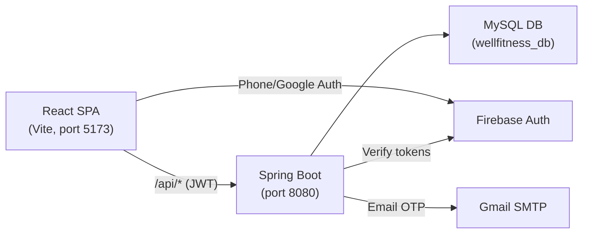

# Wellfitness — Architecture Overview

> A gym workout tracker with split management, progressive overload detection, and streak tracking.

---

## How It Works

**Flow:** User authenticates via Firebase (Google/Phone) or email+OTP → frontend stores JWT → all API calls attach JWT via Axios interceptor → backend validates JWT and serves data from MySQL.

---

## Tech Stack

| Layer | Technology | Version |
|---|---|---|
| **Frontend** | React + Vite | React 18.3 / Vite 5.4 |
| **Routing** | React Router DOM | v6.26 |
| **HTTP Client** | Axios | v1.7 |
| **Icons** | Lucide React | v0.441 |
| **Auth (Client)** | Firebase JS SDK | v12.10 |
| **Backend** | Spring Boot | 3.3.5 |
| **Language** | Java | 17 |
| **Database** | MySQL | via `mysql-connector-j` |
| **ORM** | Spring Data JPA / Hibernate | — |
| **Auth (Server)** | Spring Security + JWT (jjwt 0.12.6) | — |
| **OAuth** | Google API Client | v2.7 |
| **Firebase Admin** | Firebase Admin SDK | v9.3 |
| **Email** | Spring Boot Mail (Gmail SMTP) | — |
| **Build** | Gradle | — |

---

## Backend Structure (10 Controllers, 12 Services)

| Module | What It Does |
|---|---|
| **Auth** | Register (email+OTP), Login, Google OAuth, Firebase Phone login |
| **Onboarding** | Collect user fitness profile after first signup |
| **Dashboard** | Today's summary — streak, volume, upcoming workout |
| **Workout** | Start/stop sessions, log sets (weight × reps) |
| **Exercise** | CRUD for 150+ seeded exercises (by muscle group) |
| **Split** | Custom workout splits (PPL, Upper/Lower, etc.) with day-exercise mapping |
| **Split Templates** | Pre-built split templates users can adopt |
| **PR Detection** | Auto-detects personal records on every logged set |
| **Progressive Overload** | Suggests weight/rep increases based on history |
| **Streak** | Daily workout streak tracking |
| **Profile** | User profile management |
| **Email / OTP** | Email verification via Gmail SMTP |

---

## Frontend Screens (16 total)

| Screen | Status | Route |
|---|---|---|
| Landing, Login, Register, Onboarding | ✅ Live | `/welcome`, `/login`, `/register`, `/onboarding` |
| Dashboard, Workout, Exercises, Split, Profile, History | ✅ Live | `/`, `/workout`, `/exercises`, `/split`, `/profile`, `/history` |
| Diet, AI Coach, Rewards, Community, Progress, Phase Detail | 🔜 Placeholder | `/diet`, `/ai-coach`, `/rewards`, `/community`, `/progress`, `/phase/:id` |

---

## Deployment Considerations

| Concern | Detail |
|---|---|
| **Backend hosting** | Any Java 17 host: AWS EC2/Elastic Beanstalk, Railway, Render, DigitalOcean Droplet, or VPS |
| **Frontend hosting** | Static SPA build (`npm run build`) → Vercel, Netlify, Cloudflare Pages, or S3+CloudFront |
| **Database** | MySQL 8+ — AWS RDS, PlanetScale, Railway MySQL, or self-hosted |
| **Firebase** | Already configured (project: `ironiq-smart-gym-tracker`) — no hosting needed, just keep config |
| **SMTP** | Gmail SMTP works for low volume; switch to SendGrid/SES for production scale |
| **Env vars to secure** | DB password, JWT secret, Google Client ID, Firebase config, SMTP credentials |
| **CORS** | Already configured via `CorsConfig.java`; update allowed origins for production domain |
| **API proxy** | Dev uses Vite proxy (`/api → :8080`); in production set `API_BASE` to backend URL or use reverse proxy (Nginx) |

> [!IMPORTANT]
> Before deploying, move all secrets (JWT key, DB password, SMTP credentials) to environment variables instead of `application.properties`.

---

## Cheapest Production Setup

| Service | Provider | ~Cost |
|---|---|---|
| Backend | Railway / Render free tier | $0–$7/mo |
| Frontend | Vercel / Netlify | Free |
| MySQL | PlanetScale free tier / Railway | $0–$5/mo |
| Firebase Auth | Google (free tier covers 10K auth/mo) | Free |
| SMTP | Gmail (500 emails/day) | Free |
| **Total** | | **$0–$12/mo** |
